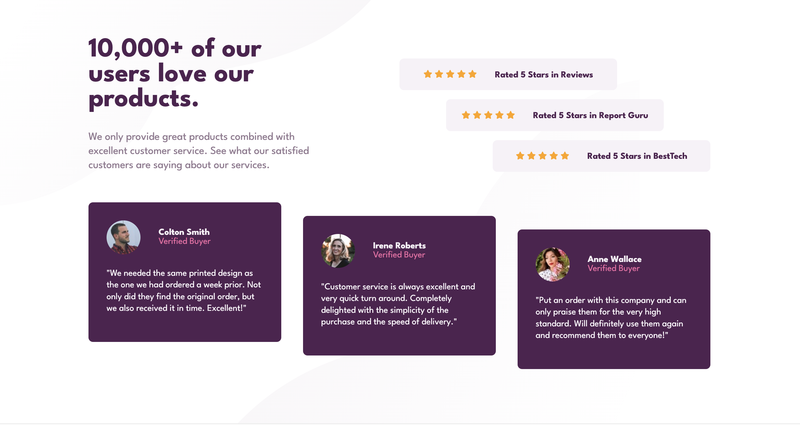

# Frontend Mentor - Social proof section solution

This is a solution to the [Social proof section challenge on Frontend Mentor](https://www.frontendmentor.io/challenges/social-proof-section-6e0qTv_bA). Frontend Mentor challenges help you improve your coding skills by building realistic projects. 

## Table of contents

- [Frontend Mentor - Social proof section solution](#frontend-mentor---social-proof-section-solution)
  - [Table of contents](#table-of-contents)
  - [Overview](#overview)
    - [The challenge](#the-challenge)
    - [Solution Screenshots](#solution-screenshots)
    - [Links](#links)
  - [My process](#my-process)
    - [Built with](#built-with)
    - [What I learned](#what-i-learned)
    - [Continued development](#continued-development)
  - [Author](#author)

## Overview

### The challenge

Users should be able to:

- View the optimal layout for the section depending on their device's screen size

### Solution Screenshots

Desktop View

Mobile View

### Links

- Solution URL: [https://github.com/mickcaff/Front-End-Mentor-Challenge-4-Social-Proof-Section](https://github.com/mickcaff/Front-End-Mentor-Challenge-4-Social-Proof-Section)
- Live Site URL: [Add live site URL here](https://your-live-site-url.com)

## My process

### Built with

- Semantic HTML5 markup
- CSS custom properties
- Flexbox
- CSS Grid
- Mobile-first workflow

### What I learned

This was my first challenge where I used CSS Grid. Over the past week I have completed two LinkedIn Learning courses that taught how to use CSS Grid and FlexBox. 

I really enjoy using CSS Grid. It is a great tool for determining layout of the page or component. 

The two CSS Grid courses I completed were:

- [CSS: Advanced Layouts with Grid](https://www.linkedin.com/learning/css-advanced-layouts-with-grid)
- [CSS: Combining Grid and Flexbox](https://www.linkedin.com/learning/css-combining-grid-and-flexbox)

### Continued development

- Continue developing CSS Grid and FlexBox skills
- Start implementing SASS
- I'm currently building my JavaScript skills and working towards attempting Front End Mentor challenges utilising JS.

## Author

- GitHub - [Mick Caffery](https://github.com/mickcaff)
- Frontend Mentor - [@mickcaff](https://www.frontendmentor.io/profile/mickcaff)
- [LinkedIn](https://www.linkedin.com/in/mcaffery/)

